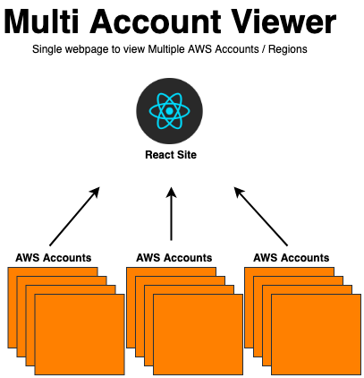
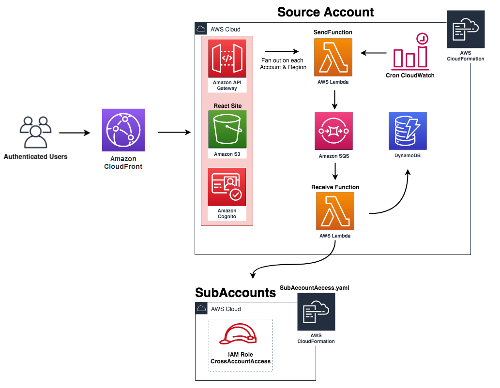
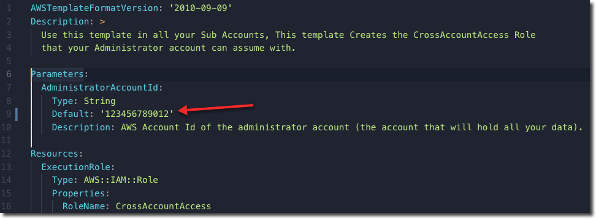
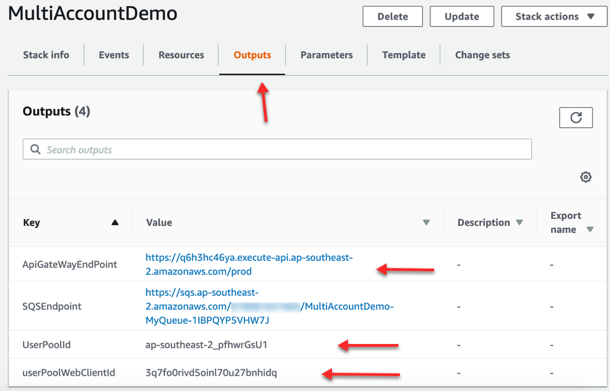
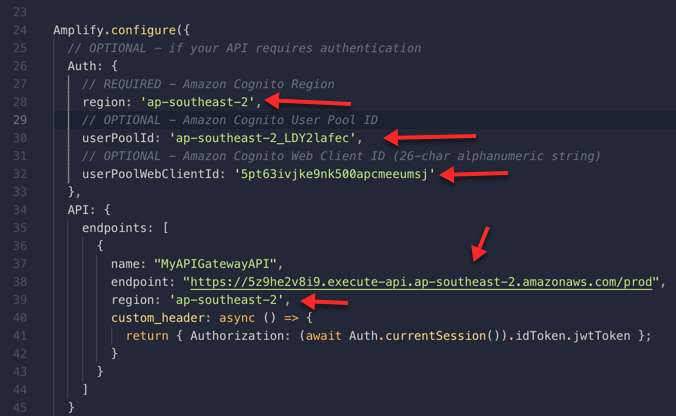
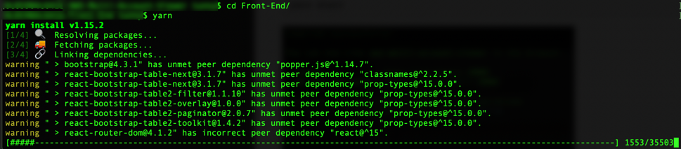
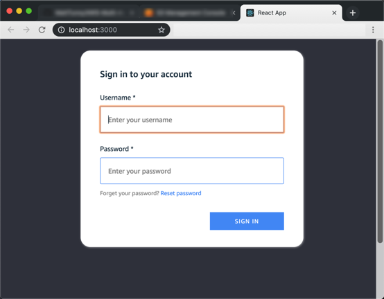
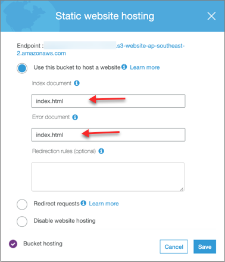
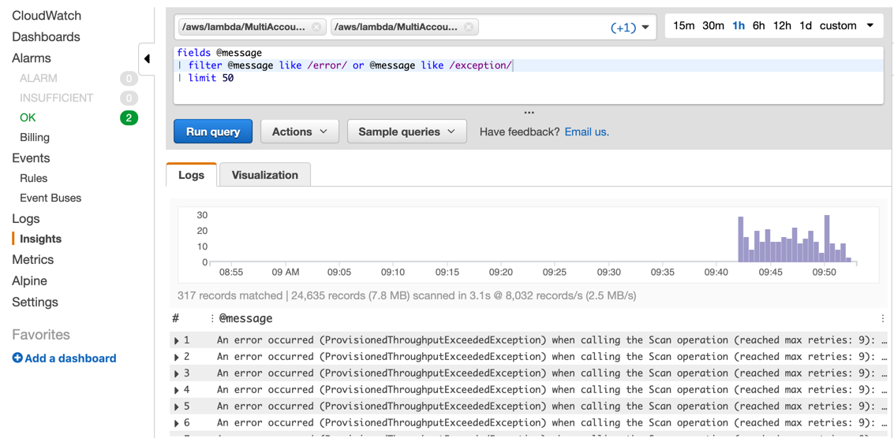

<h1 align="center">
</a>
</h1>


Serverless app designed for any customer with two or more accounts to view resources across accounts/regions in simple single pane of glass website. It's split into 2 customizable parts:

- Back-End (CloudFormation templates and Python Lambdas)
- Front-End (React with Amplify)

some of the current examples are:

- All AWS Accounts in Organizations
- All EC2, Lambdas, ODCR, EC2 Reserved Instances, RDS
- All IAM Users, Roles, Policy’s
- All VPCs, Subnets
- All S3 Buckets

## Demo

<!--  -->
</a>

## On this Page
- [Architecture](#architecture)
- [Requirements](#Requirements)
- [Install Overview](#install-overview) 
- [Deploying the Solution](#deploying-the-solution)
- [Adding New Services](#adding-new-services)
- [Troubleshooting](#Troubleshooting)
- [License](#license)

## Architecture



## Requirements

- [Python 3.7](https://www.python.org/downloads/)
- [Node.js 8.10+](https://nodejs.org/en/)
- [Yarn](https://yarnpkg.com/en/) or [NPM](https://www.npmjs.com/)
- At least 2 AWS accounts.

## Install Overview

Administrator account is the account you will use to access all sub accounts and where you will store everything.
SubAccounts only requires the SubAccountAccess template to be created.

- Clone repo.
- Run CloudFormation template in your sub accounts (SubAccountAccess.yaml).
- Run CloudFormation template in your main account (MainTemplate.yaml).
- Run React App.

## Deploying the Solution

#### Sub Accounts

- Note the Account number for your Administrator Account and put it into the SubAccountAccess template.
- Edit the __SubAccountAccess.yaml__ with your Administrator Account Number (this account number will be your Administrator account that will have access to view all the sub accounts from)

- Save and Run the __SubAccountAccess.yaml__ in all your sub accounts you want to view. (I recommend using [StackSets](https://docs.aws.amazon.com/AWSCloudFormation/latest/UserGuide/what-is-cfnstacksets.html) if you have them enabled otherwise manual is fine)

#### Administrator Account

- Create a new S3 bucket to store the lambda zip files

```bash
aws s3 mb s3://your-unique-bucket-name --region ap-southeast-2
```
- Package up all the lambdas into one zip file (e.g __functions.zip__): see example below or doco [here](https://docs.aws.amazon.com/lambda/latest/dg/lambda-python-how-to-create-deployment-package.html) 

- The only external python modules: boto3

```bash
cd /aws-multi-account-viewer/Back-End/lambdas
python3.7 -m venv .venv
source .venv/bin/activate
cd build
pip install -r ../requirements.txt --target .
zip -r9 ../functions.zip .
cd ../
zip -g functions.zip list_table.py receive_sqs_message.py send_sqs_message.py
deactivate
```

- Copy the functions.zip file you just packaged into the s3 bucket you created earlier.

```bash
aws s3 cp functions.zip s3://your-unique-bucket-name
```

#### CloudFormation Parameters

Everyone's accounts and regions vary so this example is set to the free tier for DynamoDB, Start slowly and ramp up accounts/regions to see how many RCU's you will need.

- Update all the parameters to match your config/accounts/bucket in MainTemplate.yaml
- DynamoDB is set to the free tier of 25 RCU/WCU (for large accounts/regions you will probably want this around 200+)
- Deploy the CloudFormation template in the admin account once you have updated the paramaters
- Once the CloudFormation has completed copy the details in the outputs:
    - __ApiGateWayEndPoint__
    - __UserPoolId__
    - __userPoolWebClientId__



- Paste the outputs into /aws-multi-account-viewer/Front-End/src/App.js



- Create a user account for the Cognito User Pool (sign up is disabled, so users have to be created manually)
- Cognito > User Pools > {YourStackName} > Users and groups > Create User.
- Now navigate to Front-End and Install dependencies

```bash
cd /aws-multi-account-viewer/Front-End/
yarn
```


- Start React Page

```bash
yarn start
```


- You should now see a login page from React



- Log in with the user you created earlier.
- You now have a local version up and running, you could now safely host as a public s3 bucket. 
(not covered in this project but you can see examples online on how to set it up: [S3-Public-Website](https://docs.aws.amazon.com/AmazonS3/latest/dev/HostingWebsiteOnS3Setup.html))
- A really good article on setting React up with S3 by Antoine Sauvage: [Here](https://medium.com/ovrsea/deploy-automatically-a-react-app-on-amazon-s3-iam-within-minutes-da6cb0096d55)


## Adding New Services

To add a new services, you need to updating 2 sqs lambdas and creating a new page in the Front-End. 

- Example coming soon.
- EBS unallocated across accounts.

## Troubleshooting

### No data is being populated on the web site?

- Check SQS to make sure the messages are going through to lambda
- If there’s lots of messages in the queue then there’s an issue with the lambda or DynamoDB is throttling the requests.

### Site breaks when hosted on s3?

- There's a good guide above on how to host React on S3, most common gotcha is error document:


### Lambda Logs Overview?

- You can check all three lambdas logs easy in CloudWatch Insights:


### Lambda Logs Error & Exceptions:

Copy and paste query below to only see Errors & Exceptions:
(this example is showing throttle requests on DynamoDB because its set too low):

```bash
fields @message 
| filter @message like /error/ or @message like /exception/
| limit 50
```


### Organizations tab is empty?
- Organizations isn't part of the cron job that normally goes, you need to manually refresh it.
- Go to Refresh Checks > Organizations > Send to SQS
- You should now see Organizations populated.

## License Summary

This sample code is made available under the MIT-0 license. See the LICENSE file.